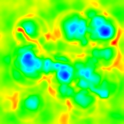
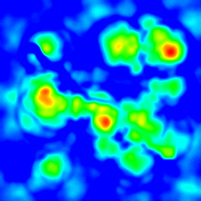
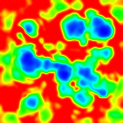
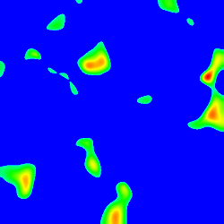
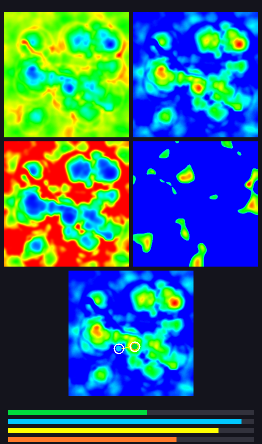

# 🛰️ Geospatial Site Selection & Route Optimization

<<<<<<< HEAD
> **A C++ geospatial analytics pipeline that processes lunar terrain datasets to identify the optimal habitat site, mining site, and the shortest feasible power cable route using statistical analysis, spatial clustering, and A* pathfinding.**

<p align="center">
=======
> **A C++ geospatial analytics pipeline that processes four 500×500 lunar terrain CSV rasters to recommend the optimal habitat site, mining site, and a slope-constrained connecting path — with automated data quality reporting and terrain visualizations.**
>>>>>>> 4f3a4cd (Improve data validation pipeline and update README for analyst workflow
)


</p>

---

<<<<<<< HEAD
# 🌙 Project Overview

Planning infrastructure on the Moon requires balancing multiple environmental constraints instead of optimizing a single metric.

This project analyzes **four 500 × 500 lunar terrain datasets** to automatically determine:

- 🏠 Optimal Habitat Location
- 🧊 Optimal Mining Location
- ⚡ Shortest Feasible Power Cable Route
- 📊 Terrain Heatmaps & Comparative Dashboard

The project follows an **ETL-style data analytics pipeline**:

```text
Extract → Clean → Transform → Analyze → Optimize → Visualize
=======
## 🌙 Project Overview

Planning infrastructure on the Moon requires balancing multiple environmental constraints instead of optimizing a single metric.

This project analyzes **four 500 × 500 lunar terrain datasets** (~250,000 cells each) to automatically determine:

- 🏠 **Optimal Habitat Location** — high illumination, low roughness
- 🧊 **Optimal Mining Location** — high water-ice probability
- ⚡ **Shortest Feasible Power Cable Route** — A* with 22 m elevation step limit
- 📊 **Terrain Heatmaps & Comparative Dashboard**

The pipeline follows an **ETL-style data analytics workflow**:

```text
Extract → Clean → Validate → Transform → Analyze → Optimize → Visualize
>>>>>>> 4f3a4cd (Improve data validation pipeline and update README for analyst workflow
)
```

---

<<<<<<< HEAD
# ✨ Key Features

- 📂 CSV Processing & Validation
- 🧹 Data Cleaning & Missing Value Handling
- 📊 Statistical Analysis (Mean & Standard Deviation)
- ⚡ ETL-style Data Processing Pipeline
- 🧠 2D Prefix Sum Optimization
- 📍 Spatial Candidate Clustering
- ⭐ Multi-Criteria Decision Scoring
- 🛣️ A* Route Optimization
- 🎨 Automatic Heatmap Generation
- 📈 Comparative Dashboard

---

# 📋 Sample Output

The pipeline generates a report (`outputs/result.txt`) containing the selected locations and evaluation metrics.
=======
## ✨ Key Features

- 📂 **CSV Processing & Validation** — four aligned 500×500 rasters
- 🧹 **Data Cleaning** — whitespace trimming, fail-fast empty-cell rejection (no silent zero imputation), numeric integrity checks
- 📋 **Data Quality Report** — `data_quality.txt` with per-layer min/max/mean and validation audit trail
- 📊 **Statistical Analysis** — 5×5 sliding-window mean & standard deviation (terrain roughness)
- ⚡ **2D Prefix Sum Optimization** — O(1) queries over **246,016** spatial windows
- 📍 **Spatial Candidate Clustering** — top-K ranking + 25×25 geographic buckets
- ⭐ **Multi-Criteria Decision Scoring** — illumination + water-ice − path penalty
- 🛣️ **A\* Route Optimization** — slope-constrained shortest path
- 🎨 **Automatic Heatmap Generation** — pure C++ BMP rendering (no external viz libraries)

---

## 📋 Sample Output

**`result.txt`**
>>>>>>> 4f3a4cd (Improve data validation pipeline and update README for analyst workflow
)

```text
Optimal Pair Found with Combined Score: 0.6863

--- Optimal Habitat Site ---
Coordinates (303,264)
Avg Illumination : 56.56%
Terrain Roughness : 2.5955 m

--- Optimal Mining Site ---
Coordinates (311,200)
Avg Water-Ice : 0.9510
Terrain Roughness : 2.0769 m

--- Power Cable Path ---
Path Length : 72 cells (7200 m)
```

**Score formula:**

```text
score = 0.5 × illumination + 0.5 × water_ice − 0.001 × path_length
```

---

<<<<<<< HEAD
# 📈 Dataset Statistics

| Property | Value |
|-----------|-------|
| Number of CSV Files | 4 |
| Grid Size | 500 × 500 |
| Total Cells Processed | 1,000,000 |
| Sliding Window | 5 × 5 |
| Candidate Pool | Top 3000 |
| Pathfinding | A* |
| Elevation Constraint | 22 m |

---

# 📊 Data Analytics Pipeline

```text
CSV Files
     │
     ▼
Data Cleaning
     │
     ▼
Validation
     │
     ▼
2D Prefix Sum Statistics
     │
     ▼
Top-K Candidate Ranking
     │
     ▼
Spatial Clustering
     │
     ▼
Multi-Criteria Scoring
     │
     ▼
A* Pathfinding
     │
     ▼
Reports & Visualizations
=======
## 📈 Dataset & Analytics Stats

| Property | Value |
|----------|-------|
| CSV layers | 4 |
| Grid size | 500 × 500 |
| Cells per layer | 250,000 |
| Total cells processed | 1,000,000 |
| 5×5 spatial windows | 246,016 |
| Candidate pool (top-K) | 3,000 per site type |
| Spatial cluster bucket | 25 × 25 cells |
| Pathfinding | A* (max 2,000 evaluations) |
| Elevation step limit | 22 m |

---

## 📊 Data Analytics Pipeline

```text
CSV Files (elevation, illumination, water_ice, signal_occultation)
        │
        ▼
Data Cleaning (trim whitespace, reject empty cells)
        │
        ▼
Validation (numeric integrity, rectangular grid, cross-layer dimensions)
        │
        ▼
data_quality.txt
        │
        ▼
2D Prefix Sum Statistics (mean + std dev per 5×5 window)
        │
        ▼
Top-K Candidate Ranking
        │
        ▼
Spatial Clustering (geographic diversity)
        │
        ▼
Multi-Criteria Scoring + A* Pathfinding
        │
        ├──► result.txt
        ├──► candidates.txt
        └──► visualization/ (heatmaps + dashboard + legend.txt)
>>>>>>> 4f3a4cd (Improve data validation pipeline and update README for analyst workflow
)
```

---

<<<<<<< HEAD
# 🧠 Algorithms Used

| Algorithm | Purpose |
|------------|---------|
| 2D Prefix Sums | Efficient Sliding Window Statistics |
| Mean & Standard Deviation | Terrain Roughness |
| Top-K Ranking | Candidate Selection |
| Spatial Clustering | Geographic Diversity |
| Weighted Scoring | Habitat–Mining Pair Evaluation |
| A* Search | Shortest Feasible Route |

---

# 🎨 Visualization Outputs

| Output | Description |
|----------|------------|
| `outputs/result.txt` | Final analytical report |
| `outputs/candidates.txt` | Ranked candidate locations |
| `outputs/visualization/comparative_dashboard.bmp` | Dashboard |
| `outputs/visualization/optimal_sites_map.bmp` | Habitat & Mining Map |
| `outputs/visualization/elevation_heatmap.bmp` | Elevation |
| `outputs/visualization/illumination_heatmap.bmp` | Illumination |
| `outputs/visualization/water_ice_heatmap.bmp` | Water Ice |
| `outputs/visualization/signal_occultation_heatmap.bmp` | Signal Occultation |

---

# 📍 Optimal Habitat & Mining Sites

The final solution selected by the optimization pipeline.

| Marker | Description |
|--------|-------------|
| 🟢 Green Circle | Optimal Habitat |
| 🔷 Cyan Circle | Optimal Mining |
| 🟡 Yellow Line | Power Cable Route |
| ⚪ White Outline | Selected Sites |
| 🌞 Background | Illumination Heatmap |

<p align="center">

</p>

---

# 🌍 Terrain Heatmaps

All heatmaps use the same normalized color scale.

```text
Blue → Cyan → Green → Yellow → Red
Low                         High
```

| Color | Meaning |
|--------|---------|
| 🔵 Blue | Lowest Values |
| 🔷 Cyan | Low–Medium |
| 🟢 Green | Medium |
| 🟡 Yellow | Medium–High |
| 🔴 Red | Highest Values |

Normalization

```text
t = (value − min)/(max − min)
```

---

## Elevation & Illumination

<p align="center">


</p>

<p align="center">
<b>Elevation</b>
&nbsp;&nbsp;&nbsp;&nbsp;&nbsp;&nbsp;&nbsp;&nbsp;&nbsp;&nbsp;&nbsp;&nbsp;&nbsp;&nbsp;&nbsp;&nbsp;&nbsp;&nbsp;&nbsp;&nbsp;&nbsp;&nbsp;&nbsp;&nbsp;&nbsp;&nbsp;&nbsp;&nbsp;
<b>Illumination</b>
</p>

---

## Water Ice & Signal Occultation

<p align="center">


</p>

<p align="center">
<b>Water Ice</b>
&nbsp;&nbsp;&nbsp;&nbsp;&nbsp;&nbsp;&nbsp;&nbsp;&nbsp;&nbsp;&nbsp;&nbsp;&nbsp;&nbsp;&nbsp;&nbsp;&nbsp;&nbsp;&nbsp;&nbsp;&nbsp;&nbsp;&nbsp;&nbsp;&nbsp;&nbsp;&nbsp;&nbsp;
<b>Signal Occultation</b>
</p>

---

# 📊 Comparative Dashboard

The dashboard combines all generated visualizations into a single analytical view.

<p align="center">

</p>

---

# 🎨 Visualization Legend

## Terrain Heatmaps

```text
Blue → Cyan → Green → Yellow → Red
Low                         High
```

| Heatmap | Blue | Red |
|----------|------|-----|
| Elevation | Lower Terrain | Higher Terrain |
| Illumination | Less Sunlight | More Sunlight |
| Water Ice | Lower Ice Probability | Higher Ice Probability |
| Signal Occultation | Lower Occultation | Higher Occultation |

---

## Optimal Sites Map

| Marker | Meaning |
|--------|---------|
| 🟢 Green Circle | Habitat |
| 🔷 Cyan Circle | Mining |
| 🟡 Yellow Line | Power Cable Route |
| ⚪ White Outline | Selected Locations |

---

## Dashboard Metrics

| Color | Metric |
|--------|--------|
| 🟢 Green | Habitat Illumination |
| 🔷 Cyan | Water-Ice Probability |
| 🟡 Yellow | Path Length *(shorter is better)* |
| 🟠 Orange | Combined Score |

---

# 📂 Repository Structure

```text
Geospatial-Site-Selection-and-Route-Optimization
│
├── README.md
├── LICENSE
├── .gitignore
│
├── src/
│   ├── main.cpp
│   ├── step1_csv.hpp
│   ├── step2_stats.hpp
│   ├── step3_pathfinding.hpp
│   ├── step4_result.hpp
│   └── step5_visualization.hpp
│
├── data/
│   ├── elevation.csv
│   ├── illumination.csv
│   ├── water_ice.csv
│   └── signal_occultation.csv
│
├── outputs/
│   ├── result.txt
│   ├── candidates.txt
│   └── visualization/
│       ├── comparative_dashboard.bmp
│       ├── optimal_sites_map.bmp
│       ├── elevation_heatmap.bmp
│       ├── illumination_heatmap.bmp
│       ├── water_ice_heatmap.bmp
│       ├── signal_occultation_heatmap.bmp
│       └── legend.txt
│
└── screenshots/
    ├── comparative_dashboard.png
    ├── optimal_sites_map.png
    ├── elevation_heatmap.png
    ├── illumination_heatmap.png
    ├── water_ice_heatmap.png
    └── signal_occultation_heatmap.png
=======
## 🧠 Algorithms Used

| Algorithm | Purpose |
|-----------|---------|
| 2D Prefix Sums | O(1) sliding-window statistics |
| Mean & Std Dev | Resource value + terrain roughness |
| Top-K Ranking | Candidate shortlisting |
| Spatial Clustering | Prevent geographic clustering bias |
| Weighted Scoring | Habitat–mining pair evaluation |
| A* Search | Shortest feasible route under slope constraint |

---

## 🎨 Visualization Outputs

| Output | Description |
|--------|-------------|
| `result.txt` | Final analytical report |
| `candidates.txt` | Top 20 habitat & mining candidates |
| `data_quality.txt` | Ingestion validation + layer statistics |
| `visualization/comparative_dashboard.bmp` | Combined analytical dashboard |
| `visualization/optimal_sites_map.bmp` | Habitat & mining site map |
| `visualization/*_heatmap.bmp` | Elevation, illumination, water-ice, signal |
| `visualization/legend.txt` | Color key and result metrics |

### Optimal Sites Map Legend

| Marker | Meaning |
|--------|---------|
| 🟢 Green circle | Optimal habitat |
| 🔷 Cyan circle | Optimal mining |
| 🟡 Yellow line | Habitat–mining connection |
| 🌞 Background | Illumination heatmap |

### Heatmap Color Scale

```text
Blue → Cyan → Green → Yellow → Red
Low                         High
```

---

## 📸 Screenshots


| Elevation | Illumination |
|:---------:|:------------:|
|  |  |

| Water Ice | Signal Occultation |
|:---------:|:------------------:|
|  |  |

---

## 📂 Repository Structure

```text
Geospatial-Site-Selection-and-Route-Optimization/
├── main.cpp                    # Pipeline orchestrator
├── step1_csv.hpp               # CSV load, cleaning, validation, data quality report
├── step2_stats.hpp             # Prefix sums, candidates, clustering
├── step3_pathfinding.hpp       # A* with slope constraint
├── step4_result.hpp            # Scoring + result.txt writer
├── step5_visualization.hpp     # Pure C++ BMP heatmaps & site maps
├── elevation.csv               # Terrain height (500×500)
├── illumination.csv            # Solar illumination (500×500)
├── water_ice.csv               # Water-ice probability (500×500)
├── signal_occultation.csv      # Signal occultation (500×500)
├── screenshots/                # PNG previews for README
├── .gitignore
└── README.md

Generated on run (not committed):
├── result.txt
├── candidates.txt
├── data_quality.txt
└── visualization/
>>>>>>> 4f3a4cd (Improve data validation pipeline and update README for analyst workflow
)
```

---

<<<<<<< HEAD
# 🚀 Build & Run

### Compile

```bash
g++ -O2 -std=c++17 src/main.cpp -o moon_landing
```

### Run

Linux / macOS

```bash
./moon_landing
```

Windows

```bash
moon_landing.exe
=======
## 🚀 Build & Run

**Requirements:** C++17 compiler (`g++`). No external libraries.

```bash
# Compile
g++ -O2 -std=c++17 main.cpp -o moon_landing

# Run (CSV files must be in the same directory)
./moon_landing          # Linux / macOS
.\moon_landing.exe      # Windows
>>>>>>> 4f3a4cd (Improve data validation pipeline and update README for analyst workflow
)
```

---

<<<<<<< HEAD
# 💻 Tech Stack

| Category | Technology |
|------------|------------|
| Language | C++17 |
| Data Processing | CSV |
| Analytics | ETL-style Pipeline |
| Statistics | Mean & Standard Deviation |
| Algorithms | 2D Prefix Sums, A* Search |
| Optimization | Spatial Clustering |
| Visualization | Pure C++ BMP Rendering |

---

# 🎓 Learning Outcomes

This project demonstrates practical implementation of:

- Large-scale CSV Processing
- Data Cleaning & Validation
- ETL Pipeline Design
- Statistical Analysis
- Spatial Data Analytics
- Graph Search Algorithms
- Performance Optimization
- Automated Visualization

---

# 📜 License
=======
## 📥 Input Data

| File | Meaning |
|------|---------|
| `elevation.csv` | Ground elevation (meters) |
| `illumination.csv` | Sunlight fraction (0–1) |
| `water_ice.csv` | Water-ice probability (0–1) |
| `signal_occultation.csv` | Communication occultation values |

---

## 💻 Tech Stack

| Category | Technology |
|----------|------------|
| Language | C++17 |
| Data Processing | CSV ingestion & validation |
| Analytics | ETL-style pipeline, descriptive statistics |
| Algorithms | 2D Prefix Sums, A* Search, Spatial Clustering |
| Visualization | Pure C++ BMP rendering |

---

## 🎓 Learning Outcomes

This project demonstrates:

- Large-scale CSV processing and data quality validation
- ETL pipeline design with fail-fast error reporting
- Spatial statistics at scale (246K windows)
- Multi-criteria geospatial decision analysis
- Graph search under physical constraints
- Automated analytical visualization

---

## 📜 License
>>>>>>> 4f3a4cd (Improve data validation pipeline and update README for analyst workflow
)

This project is intended for educational, research, and portfolio purposes.
