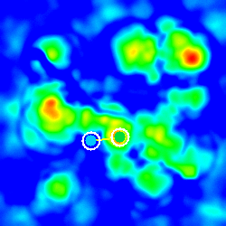

# 🛰️ Geospatial Site Selection & Route Optimization

> **A C++ geospatial analytics pipeline that processes lunar terrain datasets to identify the optimal habitat site, mining site, and shortest feasible power cable route using statistical analysis, spatial clustering, and A* pathfinding.**

<p align="center">


</p>

---

# 🌙 Project Overview

Planning infrastructure on the Moon requires balancing multiple environmental constraints rather than optimizing a single metric.

This project analyzes **four 500×500 lunar terrain datasets** to automatically determine:

- 🏠 Optimal habitat location
- 🧊 Optimal mining location
- ⚡ Shortest feasible power cable route
- 📊 Terrain heatmaps & comparative dashboard

The complete workflow follows an **ETL-style data analytics pipeline**:

```
Extract → Clean → Transform → Analyze → Optimize → Visualize
```

---

# ✨ Highlights

- 📂 CSV Processing & Validation
- 🧹 Data Cleaning & Preprocessing
- 📊 Statistical Analysis (Mean & Standard Deviation)
- ⚡ ETL-style Data Pipeline
- 🧠 2D Prefix Sum Optimization
- 📍 Spatial Candidate Clustering
- ⭐ Multi-Criteria Decision Making
- 🛣️ A* Route Optimization
- 🎨 Automatic Heatmap Generation
- 📈 Comparative Dashboard

---

# 📋 Sample Output

The pipeline generates a detailed analytical report (`result.txt`).

```text
Optimal Pair Found with Combined Score: 0.6863

--- Optimal Habitat Site ---
Coordinates (row, col): (303, 264)

Avg Illumination: 56.56%

Terrain Roughness (Std Dev): 2.5955 m

--- Optimal Mining Site ---
Coordinates (row, col): (311, 200)

Avg Water-Ice Probability: 0.9510

Terrain Roughness (Std Dev): 2.0769 m

--- Power Cable Path ---
Path Length: 72 cells (7200 m)
```

---

# 📈 Dataset Statistics

| Property | Value |
|-----------|-------|
| CSV Files | 4 |
| Grid Size | 500 × 500 |
| Total Cells Processed | 1,000,000 |
| Sliding Window | 5 × 5 |
| Candidate Pool | Top 3000 |
| Pathfinding Algorithm | A* |
| Elevation Constraint | 22 m |
| Output Visualizations | 6 |

---

# 📊 Data Analytics Pipeline

```text
CSV Files
    │
    ▼
Data Cleaning
    │
    ▼
Validation
    │
    ▼
2D Prefix Sum Statistics
    │
    ▼
Candidate Ranking
    │
    ▼
Spatial Clustering
    │
    ▼
Multi-Criteria Scoring
    │
    ▼
A* Route Optimization
    │
    ▼
Visualization & Reports
```

---

# 🧠 Algorithms Used

| Algorithm | Purpose |
|------------|---------|
| 2D Prefix Sums | O(1) sliding-window statistics |
| Mean & Standard Deviation | Terrain roughness analysis |
| Top-K Ranking | Best candidate selection |
| Spatial Clustering | Geographic diversity |
| Weighted Scoring | Habitat–Mining evaluation |
| A* Search | Shortest feasible cable route |

---

# 🎨 Visualization Outputs

The project automatically generates the following outputs.

| Output | Description |
|----------|------------|
| `comparative_dashboard.bmp` | Complete dashboard |
| `optimal_sites_map.bmp` | Habitat, mining site & route |
| `elevation_heatmap.bmp` | Elevation distribution |
| `illumination_heatmap.bmp` | Illumination distribution |
| `water_ice_heatmap.bmp` | Water-ice probability |
| `signal_occultation_heatmap.bmp` | Signal occultation |
| `result.txt` | Analytical report |
| `legend.txt` | Visualization guide |

---

# 📍 Optimal Habitat & Mining Sites

Green = Habitat

Cyan = Mining

Yellow = Power Cable Route

Background = Illumination Heatmap



---

# 🌍 Terrain Heatmaps

All terrain heatmaps use the same normalized color scale.

```
Blue → Cyan → Green → Yellow → Red
Low                           High
```

| Color | Meaning |
|--------|---------|
| 🔵 Blue | Lowest values |
| 🔷 Cyan | Low–Medium |
| 🟢 Green | Medium |
| 🟡 Yellow | Medium–High |
| 🔴 Red | Highest values |

Normalization:

```text
t = (value − min) / (max − min)
```

where **t ∈ [0,1]**.

---

## Elevation & Illumination

| Elevation | Illumination |
|------------|--------------|
| 
 | 
 |

---

## Water Ice & Signal Occultation

| Water Ice | Signal Occultation |
|------------|--------------------|
| 
 |  |

---

# 📊 Comparative Dashboard

The dashboard combines all generated visualizations and summarizes the key decision metrics.


### Dashboard Metrics

| Color | Metric |
|--------|--------|
| 🟢 Green | Habitat Illumination |
| 🔷 Cyan | Mining Water-Ice Probability |
| 🟡 Yellow | Path Length *(shorter is better)* |
| 🟠 Orange | Combined Score |

---

# 🎯 Visualization Legend

### Heatmaps

Blue → Lowest values

Red → Highest values

### Optimal Sites

🟢 Green Circle → Habitat

🔷 Cyan Circle → Mining

🟡 Yellow Line → Power Cable Route

⚪ White Outline → Site Highlight

### Dashboard

Displays:

- Terrain heatmaps
- Optimal sites
- Comparative metric bars
- Final optimization score

---

# 📂 Project Structure

```text
Geospatial-Site-Selection-and-Route-Optimization/

│
├── main.cpp
├── step1_csv.hpp
├── step2_stats.hpp
├── step3_pathfinding.hpp
├── step4_result.hpp
├── step5_visualization.hpp
│
├── elevation.csv
├── illumination.csv
├── water_ice.csv
├── signal_occultation.csv
│
├── result.txt
├── candidates.txt
│
├── visualization/
│
├── screenshots/
│
└── helper.txt
```

---

# 🚀 Build & Run

### Compile

```bash
g++ -O2 -std=c++17 main.cpp -o moon_landing
```

### Run

Linux / macOS

```bash
./moon_landing
```

Windows

```bash
moon_landing.exe
```

---

# 💻 Tech Stack

| Category | Technology |
|------------|------------|
| Language | C++17 |
| Data Processing | CSV |
| Analytics | ETL Pipeline |
| Statistics | Mean, Standard Deviation |
| Algorithms | 2D Prefix Sums, A* Search |
| Optimization | Spatial Clustering |
| Visualization | Pure C++ BMP Generation |

---

# 🎓 Learning Outcomes

This project demonstrates practical implementation of:

- Large-scale CSV processing
- Data validation & cleaning
- ETL pipeline design
- Statistical analysis
- Spatial data analytics
- Graph search algorithms
- Performance optimization
- Automated visualization generation

---

# 📜 License

This project is intended for educational, research, and portfolio purposes.
